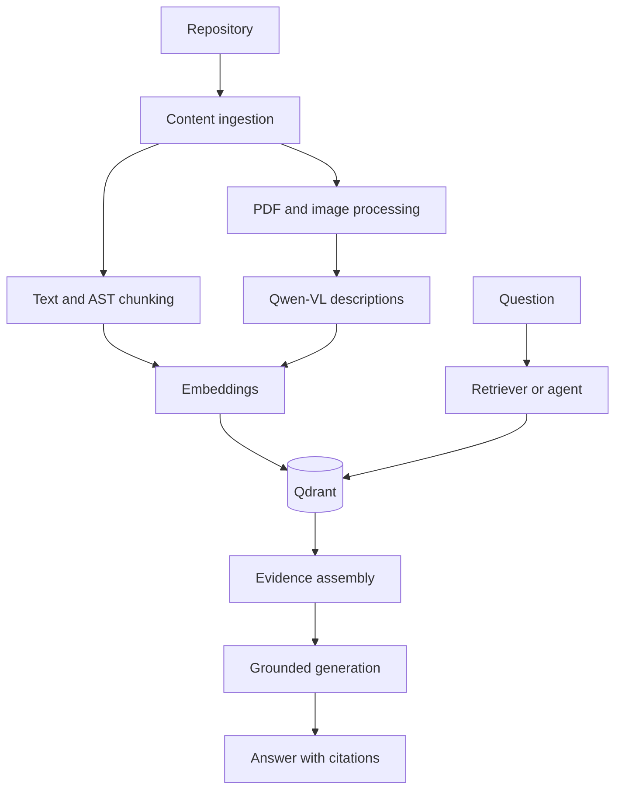

# RepoLens

RepoLens is a multimodal, citation-first repository intelligence assistant. It uses retrieval-augmented generation (RAG) to help developers explore unfamiliar codebases, locate relevant implementation details, understand documentation and architecture assets, and answer repository questions with traceable evidence.

> **Project status:** MVP 1 is under active development. The repository-ingestion foundation is available; the remaining capabilities described below define the planned MVP 1 release. This README is intentionally written as an MVP-level blueprint so it can remain stable throughout development.

## Why RepoLens?

Understanding a repository often requires searching across source code, Markdown documentation, PDFs, screenshots, and architecture diagrams. Traditional keyword search can locate exact text, but it does not reliably connect related concepts across these sources or explain how the evidence answers a question.

RepoLens is designed to:

- index supported repository content without executing the target code;
- retrieve relevant code, documentation, and visual evidence;
- preserve source paths, page numbers, symbols, and line ranges;
- generate answers grounded only in retrieved evidence;
- attach inspectable citations to repository-specific claims;
- report insufficient evidence instead of inventing an answer; and
- expose retrieval and agent traces for debugging and evaluation.

## MVP 1 Scope

MVP 1 is organized around four capability groups.

| Area | MVP 1 outcome |
| --- | --- |
| Text retrieval | Ingest Python, Markdown, and text files; create stable chunks and embeddings; index them in Qdrant; and retrieve ranked evidence. |
| Code intelligence | Chunk Python by modules, classes, functions, and methods, while retaining symbol and line-range metadata. |
| Multimodal understanding | Extract PDF text and page images, process screenshots and diagrams with Qwen-VL, and retrieve visual evidence alongside code. |
| Application and agent layer | Provide cited answers through FastAPI, a Streamlit interface, and a bounded LangGraph workflow with observable tool routing. |

## Available Foundation

The current ingestion layer provides:

- recursive, deterministic repository discovery;
- support for `.py`, `.md`, and `.txt` files;
- pruning of ignored directories before traversal;
- filtering of unsupported, generated, binary, symlinked, and oversized files;
- Python-aware encoding detection and UTF-8 text handling;
- Unicode and newline normalization;
- safe handling of empty, invalid, and unreadable files;
- repository, path, file type, byte size, and SHA-256 metadata;
- failure isolation so one invalid file does not stop ingestion;
- structured logging and an ingestion summary;
- a command-line ingestion interface; and
- automated tests for discovery, filtering, loading, metadata, error handling, and CLI behavior.

## Architecture



### Ingestion flow

1. **Discover** supported files while pruning ignored paths and unsafe inputs.
2. **Load** bytes safely, detect encoding, normalize text, and calculate content hashes.
3. **Chunk** Markdown by headings, plain text by bounded windows, and Python by AST symbols when possible.
4. **Describe visual content** from PDF pages, screenshots, and diagrams using structured Qwen-VL output.
5. **Embed** text and visual descriptions in configurable batches.
6. **Index** vectors and metadata in Qdrant using stable identifiers.

### Question-answering flow

1. Accept a question through the CLI, API, or Streamlit interface.
2. Select the relevant retrieval path for code, documents, images, or mixed evidence.
3. Retrieve and deduplicate ranked results while retaining source metadata.
4. Assemble a balanced context within the configured token budget.
5. Generate an evidence-grounded answer.
6. Validate citations and return an insufficient-evidence response when support is missing.

## Technology Stack

| Layer | Technology |
| --- | --- |
| Language | Python 3.11 |
| API | FastAPI and Pydantic |
| Interface | Streamlit |
| Vector database | Qdrant |
| Embeddings | Open-source sentence embedding model |
| Visual understanding | Qwen-VL |
| Agent workflow | LangGraph |
| Testing | pytest |
| Packaging | Docker and Docker Compose |

Exact model identifiers and runtime settings will be recorded with the reproducible MVP 1 evaluation results rather than hard-coded in this overview.

## Getting Started

### Prerequisites

- Python 3.11
- Git
- `pip`
- Docker with Docker Compose for the complete MVP stack
- An NVIDIA GPU is recommended for local visual-language-model inference, but it is not required for the text-ingestion foundation

### Create an isolated environment

From the project root:

```bash
python3.11 -m venv venv
source venv/bin/activate
python -m ensurepip --upgrade
python -m pip install --upgrade pip setuptools wheel
python -m pip install -r requirements.txt
```

On Windows PowerShell, activate the environment with:

```powershell
.\venv\Scripts\Activate.ps1
```

If the project is installed as an editable package, commands can be run without setting `PYTHONPATH`:

```bash
python -m pip install -e .
```

For NVIDIA systems, install the PyTorch build recommended by the official PyTorch installation selector for the machine's driver and CUDA environment. Do not guess a CUDA wheel URL.

## Usage

### Ingest a repository

Run the ingestion command from the RepoLens project root:

```bash
PYTHONPATH=src python -m repolens.cli ingest /path/to/repository
```

Show file-level ingestion events:

```bash
PYTHONPATH=src python -m repolens.cli ingest /path/to/repository --log-level INFO
```

Provide a metadata name and custom maximum file size:

```bash
PYTHONPATH=src python -m repolens.cli ingest /path/to/repository \
  --repository-name example-repository \
  --max-file-size 1048576 \
  --log-level INFO
```

The command reports discovered, ingested, empty, and failed file counts. Individual failures are isolated and logged without terminating the entire repository job.

### Full MVP interfaces

The completed MVP 1 will support the same ingestion and question-answering workflow through:

- a semantic-search and question-answering CLI;
- FastAPI endpoints for health, ingestion, job status, repository summaries, and queries;
- a Streamlit interface for repository selection, ingestion progress, questions, citations, evidence, scores, latency, and optional debugging; and
- a Docker Compose stack for the API, interface, and persistent Qdrant service.

The final launch and request examples will be derived from the packaged application to keep them reproducible.

## File Selection and Safety

The text-ingestion foundation accepts:

```text
.py  .md  .txt
```

MVP 1 multimodal ingestion extends discovery to supported PDF and image formats.

RepoLens excludes common repository noise and unsafe inputs, including:

- Git metadata;
- virtual environments and dependency directories;
- cache, build, and distribution artifacts;
- generated files;
- unsupported formats and binary content;
- file and directory symlinks; and
- files larger than the configured limit.

RepoLens reads repository artifacts for analysis; it does not execute code from the repository being indexed.

## Metadata and Traceability

Each ingested document records:

- repository name;
- relative source path;
- source or file type;
- original byte size; and
- SHA-256 content hash.

Later pipeline stages extend this metadata with stable chunk IDs, line ranges, symbol names and types, PDF page numbers, image dimensions, retrieval scores, and source-specific citation information.

Code citations use the following form:

```text
path/to/file.py:start-line-end-line
```

PDF and image evidence retains its original path and page or asset reference.

## Reliability Principles

RepoLens follows several MVP-level design rules:

- **Deterministic ingestion:** the same unchanged repository produces stable ordering and identifiers.
- **Idempotent indexing:** re-ingestion does not duplicate unchanged content.
- **Failure isolation:** corrupt or unreadable content is reported without stopping the complete job.
- **Evidence-first answers:** repository-specific claims must be supported by retrieved evidence.
- **Citation validation:** generated citations must resolve to known sources and valid locations.
- **Bounded agent execution:** agent runs have explicit step and retry limits.
- **Observable behavior:** ingestion decisions, retrieval results, tool calls, latency, and termination reasons can be inspected.

## Testing

Run the complete test suite:

```bash
python -m pytest -v
```

Run only the ingestion and CLI tests:

```bash
python -m pytest tests/test_file_loader.py tests/test_cli.py -v
```

The MVP 1 test strategy covers:

- supported, ignored, empty, invalid, generated, symlinked, and oversized files;
- deterministic discovery, normalized content, metadata, and hashes;
- chunk boundaries, AST fallbacks, and stable chunk IDs;
- Qdrant indexing, filtering, retrieval, and idempotency;
- citation formatting and validation;
- API success and failure behavior;
- multimodal asset and PDF-page traceability;
- agent routing, retry limits, and tool failures; and
- end-to-end ingestion, retrieval, and answer generation.

## Evaluation

MVP 1 will be evaluated on a versioned set of manually verified repository questions.

| Category | Metrics |
| --- | --- |
| Retrieval | Recall@5 and mean reciprocal rank (MRR) |
| Grounding | Citation precision and answer faithfulness |
| Agent behavior | Tool-selection accuracy, failure rate, and termination behavior |
| Performance | End-to-end latency, retrieval time, generation time, and GPU memory where available |
| Multimodal quality | Expected file/page retrieval, citation correctness, and answer quality |

The final comparison will report baseline dense RAG and multimodal agentic RAG under the same evaluation conditions. Results, configuration, model identifiers, traces, and failure analysis will be saved so reported claims can be reproduced.

## MVP 1 Definition of Done

MVP 1 is complete when:

- a repository can be ingested and queried from a clean environment;
- code, Markdown, text, PDFs, screenshots, and diagrams remain traceable to their sources;
- Python symbols are retrieved with useful structural and line metadata;
- questions can combine code, document, and visual evidence;
- grounded answers include valid citations or explicitly report insufficient evidence;
- the CLI, FastAPI service, and Streamlit interface use the same backend pipeline;
- the LangGraph workflow terminates safely and exposes an execution trace;
- evaluation results and limitations are reproducible and documented;
- automated unit and integration tests pass; and
- the documented Docker command starts the required services with persistent Qdrant storage.

## Known MVP Limitations

- Code-aware parsing is Python-first; other languages initially use baseline text chunking.
- Visual answers depend on the quality of extracted PDF content and generated Qwen-VL descriptions.
- Retrieval and citation validation improve traceability but do not guarantee that every generated interpretation is correct.
- Local VLM inference may require substantial GPU memory and can be slower on limited hardware.
- MVP 1 focuses on repository understanding, not autonomous code modification or execution.
- Authentication, multi-user tenancy, hosted scaling, and production security hardening are outside the initial portfolio MVP.

## After MVP 1

Potential follow-up work includes support for additional programming languages, hybrid lexical-vector search, reranking, incremental filesystem watching, richer repository graphs, expanded multimodal retrieval, hosted deployment, and team collaboration features. These are Version 2 candidates rather than commitments in the MVP 1 scope.

## Project Author

RepoLens is developed by **Harsh Patel** as a portfolio project focused on practical RAG, multimodal AI, agent workflows, evaluation, and reproducible ML engineering.
