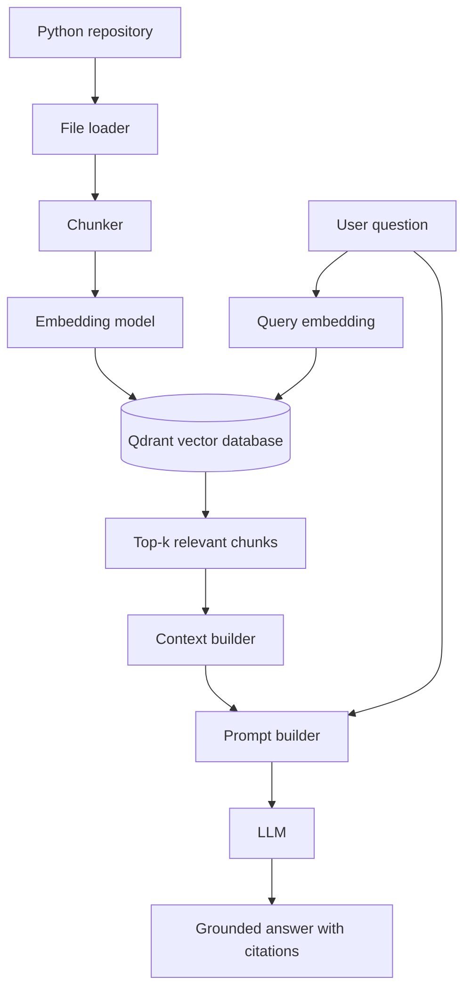

# RepoLens RAG data flow


## Two connected flows
1. **Indexing flow — runs when a repository is added or changed**
    - **Python repository**: input files such as `.py`, `.md`, and `.txt`.
    - **File loader**: discovers supported files, ignores unwanted directories, reads content, and records file metadata.
    - **Chunker**: splits large files into smaller searchable units while preserving path and line numbers.
    - **Embedding model**: converts each chunk into a numeric vector representing its meaning.
    - **Qdrant**: stores each vector together with its original text and metadata.

Data entering Qdrant:
```json
{
  "chunk_id": "stable-id",
  "text": "def verify_token(...): ...",
  "vector": "[numeric embedding]",
  "metadata": {
    "repository": "example-repo",
    "path": "app/auth.py",
    "start_line": 15,
    "end_line": 34,
    "file_type": "python"
  }
}
```

2. **Question-answering flow — runs for every question**
    1. The user asks a repository question.
    2. The same embedding model converts the question into a query vector.
    3. Qdrant compares that vector with stored chunk vectors.
    4. The top-k most similar chunks are returned as evidence.
    5. The context builder removes duplicates, respects the token limit, and formats evidence with citations.
    6. The prompt builder combines the question, evidence, and grounding instructions.
    7. The LLM writes an answer based only on the supplied evidence.
    8. RepoLens returns the answer with citations such as `app/auth.py:15-34`.